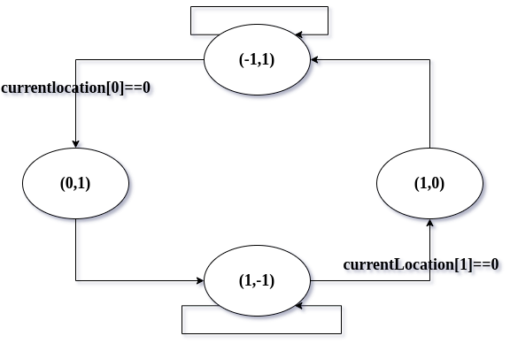

# why the `fastPalindromic` works fast?
the idea is to multiply the bigger numbers initially and the first palindromic number is the answer.
imagine a matrix:

|b↓ a→| 999 | 998 | 997 | 996 | 995 | ... | 100 |
| :-: | :-: | :-: | :-: | :-: | :-: | :-: | :-: |
| 999 |  1  |  2  |  6  |  7  |  15 | ... |     |
| 998 |  3  |  5  |  8  |  14 |     | ... |     |
| 997 |  4  |  9  |  13 |     |     | ... |     |
| 996 |  10 |  12 |     |     |     | ... |     |
| 995 |  11 |     |     |     |     | ... |     |
| ... | ... | ... | ... | ... | ... | ... |     |
| 100 |     |     |     |     |     |     |     |

the numbers shows the loops order execution. 
for instance in number nine the code will evaluate `998*997`.

# How to surf the matrix in described order?
we have a `currentLocation` variable that indicates one of the matrix cells location. 
in each loop `currentLocation` moves by `step`.

